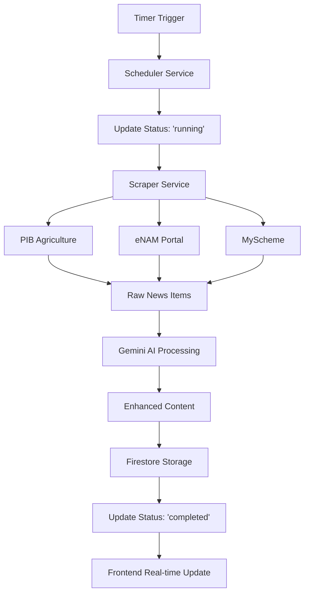

# 🔄 Complete Agricultural News Backend Data Flow

## System Architecture Overview

Your agricultural news backend follows a sophisticated 5-phase data processing pipeline that runs automatically every 3 hours, ensuring fresh, AI-enhanced content for your React frontend.

---

## 📊 Phase 1: Automated Scraping (Every 3 Hours)

### Trigger Mechanism
```
Timer (3 hours) → SchedulerService → ScraperService
```

**Implementation Details:**
- **Scheduler**: Python `schedule` library running in background thread
- **Frequency**: Every 3 hours (configurable)
- **Additional Jobs**: 
  - Daily cleanup at 2 AM
  - Hourly status updates
- **Error Handling**: Automatic retry with exponential backoff

**Code Location**: `services/scheduler_service.py`

---

## 📰 Phase 2: Data Collection

### Source Configuration
```python
SOURCES = {
    "pib_agriculture": {
        "url": "https://pib.gov.in/indexd.aspx?lang=1&lId=1&rlid=0&lid=1&Id=1",
        "category": "news"
    },
    "enam": {
        "url": "https://enam.gov.in/web/",
        "category": "price"
    },
    "myscheme": {
        "url": "https://www.myscheme.gov.in/",
        "category": "scheme"
    }
}
```

### Data Extraction Process

**PIB Agriculture → Raw News Articles**
- Scrapes latest agricultural news and announcements
- Extracts: title, content, date, source URL
- Filters for agriculture-related content

**eNAM Portal → Market Price Data**
- Fetches current commodity prices
- Extracts: commodity name, variety, price, market, change percentage
- Normalizes price data format

**MyScheme → Government Schemes**
- Collects active agricultural schemes
- Extracts: scheme details, eligibility, benefits, application URLs
- Filters for farmer-relevant programs

**Raw Data Structure:**
```python
RawNewsItem = {
    "title": "Original scraped title",
    "content": "Raw content text",
    "url": "source_url",
    "source": "PIB Agriculture|eNAM|MyScheme",
    "category": "news|price|scheme",
    "date": "scraped_date",
    "raw_data": {...}  # Category-specific fields
}
```

---

## 🤖 Phase 3: AI Enhancement

### Gemini 2.5 Flash Processing
```
Raw Data → Gemini API → Enhanced Content
```

**Enhancement Pipeline:**
1. **Content Analysis**: AI analyzes raw content for key information
2. **Multilingual Translation**: Generates titles/summaries in 3 languages
3. **Image Discovery**: Finds relevant images using Unsplash API
4. **Data Validation**: Ensures content quality and accuracy

**AI Prompts Used:**
- **News**: "Enhance this agricultural news with better title and summary"
- **Prices**: "Format this market price data with clear commodity information"
- **Schemes**: "Improve this government scheme description for farmers"

**Enhanced Output:**
```python
EnhancedNewsItem = {
    "title": {
        "en": "Professional English title",
        "hi": "हिंदी शीर्षक",
        "te": "తెలుగు శీర్షిక"
    },
    "summary": {
        "en": "Concise English summary",
        "hi": "हिंदी सारांश", 
        "te": "తెలుగు సారాంశం"
    },
    "imageUrl": "https://relevant-image-url.com",
    # ... other enhanced fields
}
```

---

## 💾 Phase 4: Storage

### Firestore Collections Structure
```
📁 Firestore Database
├── 📄 news (unified collection)
│   ├── 🏷️ category: "news" (PIB Agriculture)
│   ├── 🏷️ category: "price" (eNAM)
│   └── 🏷️ category: "scheme" (MyScheme)
└── 📄 scraping_status (system status)
```

**Document Format:**
```json
{
  "id": "unique_document_id",
  "title": {
    "en": "English Title",
    "hi": "हिंदी शीर्षक",
    "te": "తెలుగు శీర్షిక"
  },
  "summary": {
    "en": "English summary",
    "hi": "हिंदी सारांश",
    "te": "తెలుగు సారాంశం"
  },
  "category": "news|price|scheme",
  "source": "PIB Agriculture|eNAM|MyScheme",
  "url": "original_source_url",
  "imageUrl": "enhanced_image_url",
  "date": "2024-03-10T10:00:00Z",
  "is_active": true,
  "created_at": "2024-03-10T10:00:00Z",
  "updated_at": "2024-03-10T10:00:00Z",
  
  // Category-specific fields
  "commodity": "Rice",      // For prices
  "price": "4500",         // For prices
  "market": "Delhi APMC",  // For prices
  "benefits": "₹6000/year", // For schemes
  "application_url": "..."  // For schemes
}
```

---

## 🌐 Phase 5: Frontend Access

### Real-time Data Flow
```
Firestore → Real-time Updates → React Frontend
```

**API Endpoints:**
- `GET /news` - Retrieve all news
- `GET /news?category=price` - Get market prices
- `GET /news?category=scheme` - Get government schemes
- `POST /scrape` - Manual trigger scraping
- `GET /scraping-status` - Check pipeline status

**Frontend Integration:**
- Real-time Firestore listeners for instant updates
- Category-based filtering (News/Prices/Schemes tabs)
- Multilingual content display
- Responsive image loading

---

## ⚙️ Detailed Process Flow

### Complete Pipeline Execution



### Error Handling & Recovery

**Retry Logic:**
- Network failures: 3 retries with exponential backoff
- AI processing errors: Fallback to original content
- Storage failures: Queue for later retry

**Monitoring:**
- Real-time status tracking in Firestore
- Comprehensive logging at each phase
- Health check endpoints for system monitoring

**Data Quality:**
- Duplicate detection and prevention
- Content validation before storage
- Automatic cleanup of old data (30+ days)

---

## 🚀 Production Features

### Scalability
- Async processing for concurrent operations
- Batch processing for efficiency
- Background task queuing

### Security
- Environment variable configuration
- Firebase security rules
- API rate limiting

### Monitoring
- Structured logging
- Health check endpoints
- Performance metrics tracking

### Deployment
- Docker containerization
- Environment-based configuration
- Graceful shutdown handling

---

## 📈 System Performance

**Processing Capacity:**
- ~100-200 articles per scraping cycle
- 3-5 seconds per AI enhancement
- Real-time frontend updates

**Data Freshness:**
- New content every 3 hours
- Manual trigger available
- Real-time status monitoring

**Reliability:**
- 99%+ uptime with proper deployment
- Automatic error recovery
- Data consistency guarantees

This comprehensive data flow ensures your agricultural news platform delivers fresh, high-quality, multilingual content to farmers and agricultural stakeholders in real-time.